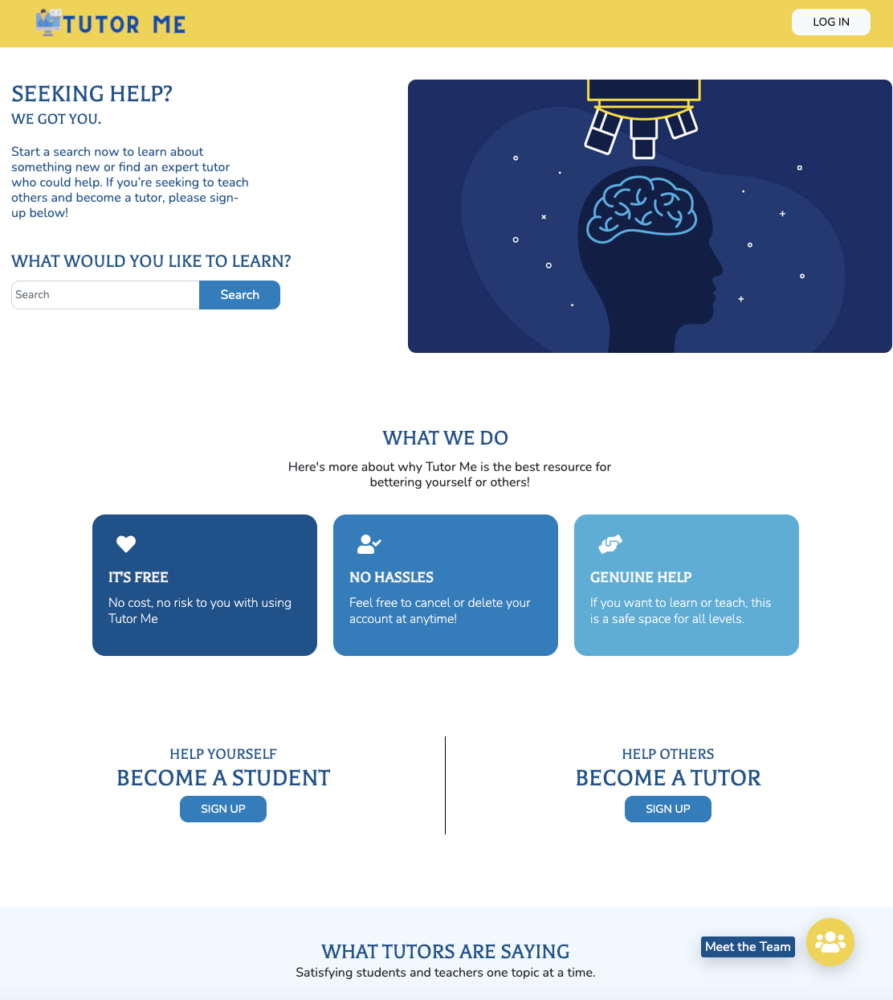

<!--===== INTRODUCTION =====-->
<p align="center">
    

  <h3 align="center">Tutor Me</h3>

  <p align="center">
    TutorMe connects people to tutors based on subject topic/maybe an ability to filter through youtube videos on subject topic as well</p>
</p>

<br />

<!--===== TABLE OF CONTENTS =====-->
<details open="open">
  <summary><h2 style="display: inline-block">Table of Contents</h2></summary>
  <ol>
    <li>
      <a href="#about-the-project">About The Project</a>
      <ul>
        <li><a href="#built-with">Built With</a></li>
      </ul>
    </li>
    <li>
      <a href="#getting-started">Getting Started</a>
      <ul>
        <li><a href="#prerequisites">Prerequisites</a></li>
        <li><a href="#installation">Installation</a></li>
      </ul>
    </li>
    <li><a href="#usage">Usage</a></li>
    <li><a href="#contact">Contact</a></li>
    <li><a href="#acknowledgements">Acknowledgements</a></li>
  </ol>
</details>

<!--===== ABOUT THE PROJECT =====-->
## About The Project

<p align="center">
    
    <p>

TutorMe connects Students/information seekers with tutors so that
They can become more knowledgeable about the subject they are seeking help with and they can connect with the tutors and the students should also be able to filter the educational youtube videos.

### Built With

* HTML
* CSS
* Bootstrap
* Javascript

<!--===== GETTING STARTED =====-->
## Getting Started

To get a local copy up and running follow these simple steps.

### Installation

1. Clone the repo
   ```sh
   git clone git@github.com:chingu-voyages/v29-toucans-team-01.git
   ```
2. Go live and run in your local browser


<!--===== USAGE EXAMPLES =====-->
## Usage

**This is where the GIF will go!**


<!--===== CONTACT =====-->
## Contact

Ashley Christie - [GitHub](https://github.com/ach0319)

Andrew Denson - [GitHub](https://github.com/DrewDen)

Hugo Ruiz - [GitHub](https://github.com/hruizvil)

Tamara Harris - [GitHub](https://github.com/CodenameTam)

Project Link: [Tutor Me](https://toucans01tutorme.netlify.app/)


<!--===== ACKNOWLEDGEMENTS =====-->
## Acknowledgements

* [Chingu.io](https://chingu.io) - Where we all got to collaborate and make something amazing
* Ambareen Sultana & Renee Twombly - Being amazing product owners and structuring this process along with creating the *Tutor Me logo*!
